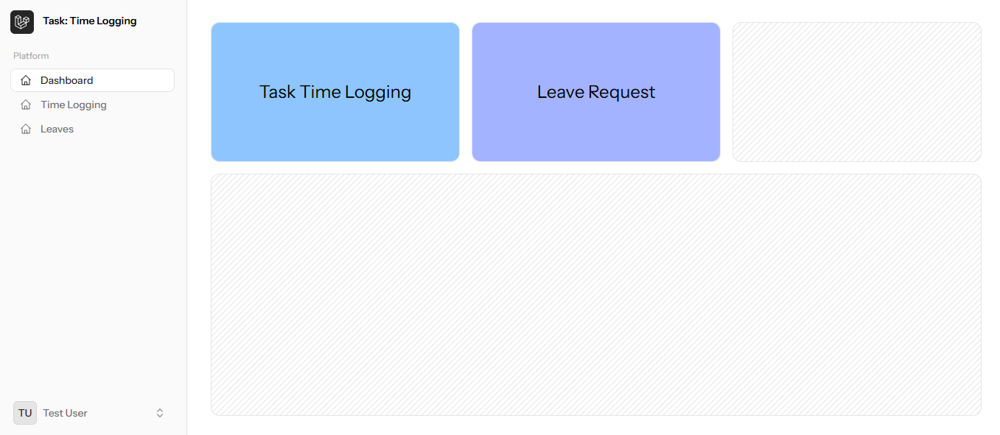

# Task Time Log System (Laravel + Livewire)

## Overview

This project is a Laravel-based task implementation to manage time logs for users. It includes features to:
- Add a time log.
- Restrict users from logging more than **10 hours per day**.
- Proper test cases to validate functionality.
- Leave application with validation against existing logs
- Editable task entries, grouped by date

This README will guide you on how to set up the project, run the application, and execute test cases for validation.

---

## Screenshots

**Dashboard Screen**


**Time Log Detail - Main Screen**


**Leave Detail - Main Screen**


**Test cases Response**


**Dark Theme Support**


---

## Requirements

- PHP >= 8.1
- Composer >= 2.x
- MySQL >= 8.x
- Laravel >= 10.x
- Node.js & NPM (for frontend assets, if applicable)


## 🛠️ Stack
- Laravel 12.x
- Livewire 3.x
- Tailwind
- MySQL

---

## Installation & Setup

1. **Clone the Repository**
   ```bash
   git clone https://github.com/shalender8928/task-tracking.git
   cd task-tracking
   ```
2. **Install PHP Dependencies**
   ```bash
   composer install
   ```
3. **Environment Configuration**
   ```bash
   cp .env.example .env
   php artisan key:generate
   ```
4. **Run Migrations**
   ```bash
   php artisan migrate
   ```
5. **Run Seeders (if applicable)**
   ```bash
   php artisan db:seed
   ```
5. **Serve the Application**
   ```bash
   php artisan serve
   ```

## ✅ Features
- Time log entry with hours & minutes
- Prevent future dates & total over 10 hrs
- Leave form blocks date overlap with work logs
- View task list grouped by date

# Running Test Cases
Test cases have been written using Laravel’s built-in PestPHP / PHPUnit testing framework. To execute the tests, follow these steps:

## Run All Tests:
   ```bash
   php artisan test --env=testing
   ```
## Run Specific Test File (Recommended for Task Review):
   ```bash
   php artisan test --filter=TimeTrackerTest --env=testing
   ```
This will run only the tests inside `tests/Feature/TimeTrackerTest.php`.

# Test Cases Covered:
1. **User can add a time log**

- Validates that a user can successfully add a time log entry.
- User cannot log more than 10 hours per day
- Ensures that a user is restricted from logging more than 10 hours of time entries for a single day.
- The test will assert a validation failure with appropriate error messages.

# Additional Notes
- No UI/frontend changes are required for this task.
- All validations are handled via backend logic.
- You can adjust the test data inside TimeTrackerTest.php if needed for further scenarios.


## Links

- Blog：[https://www.codinghelpsolutions.com/](https://www.codinghelpsolutions.com/)
- GitHub：[https://github.com/shalender8928](https://github.com/shalender8928)
- LinkedIn：[https://www.linkedin.com/in/shalender8928/](https://www.linkedin.com/in/shalender8928/)


## License

laravel-bjyblog is open-sourced software licensed under the MIT license.